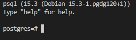
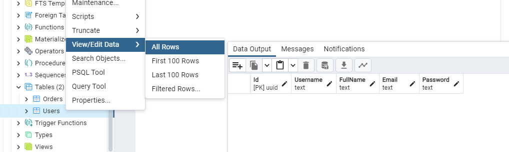

#  Amarradero Llanero

Amarradero Llanero focuses on integrating Camunda, a business process automation platform, with a .NET Core application. The integration allows for the management of workflow and tasks in Camunda while connecting to a PostgreSQL database for storing and retrieving relevant information.

## Index

1. [Description](#description)
2. [Prerequisites](#prerequisites)
3. [Usage](#usage)

## Description

The integration of Camunda and .NET Core plays a pivotal role in enhancing automation and efficiency within business processes. The Amarradero Llanero project is designed using Docker containers to ensure both application portability and scalability. Leveraging a PostgreSQL database, the project effectively stores pertinent data, while orchestrating processes and tasks through Camunda to streamline activities.

Centered around the creation of a restaurant order management system, the project leverages Docker, ASP.NET Core, Camunda BPM, and PostgreSQL. This comprehensive application empowers users to register, place orders from various sections of the restaurant, and seamlessly automates workflow processes. Notably, all user and order information is securely retained within the PostgreSQL database.

The database store the following attributes for each instance of BPM model:
**Table Users**
| Id     | Username        | Fullname       | Email           | Password     |
| ------------- | --------------------|-----------------------|--------------------|--------------- |
|Unique identifier| User's username | Full name | Email address | Password |

**Table Orders**
| Id     | CurrentDate        | PedidoAsadero       | CantPedidoAsadero           | PedidoCocina     | CantPedidoCocina | pedidoBar| cantPedidoBar |
| ------------- | ---------|-----------|-----------|------------|------------|--------|--------------- |
|Unique identifier for each record.| The date when the order was placed. | The order from the grill section. | The quantity of the grill order. | The order from the kitchen section. | The quantity of the kitchen order. |  The order from the bar section.  |  The quantity of the bar order. |

## Prerequisites
Before running the program, ensure that you have the following prerequisites installed:

1. **Code editor**: If you want to modify AmarraderoLlanero, we recommend you to use Visual Studio Code (VS Code). You can download it from the [official website].(https://code.visualstudio.com/download).

2. **Version control system**: Install GIT from the [official website](https://git-scm.com/downloads).
3. **Clone the repository**: Use the following command to clone the repository: `git clone https://github.com/BPMN-sw-evol/AmarraderoLlanero.git`.
4. **Docker Desktop**: To use Docker correctly follow the steps below:
    - **Step 1**: Install Docker from the [official website](https://www.docker.com/products/docker-desktop/).*(If you already have Docker Desktop installed, skip this step).*
    - **Step 2**: Create a Docker Hub account from the [official website](https://hub.docker.com/signup), and log in to Docker Desktop.
    *(If you already have an account, log in directly to Docker Desktop)*
5. **WSL2**: According to your need:
    - Use the following command to install WSL2
    `wsl --list --o` to know the available distributions.
    `wsl --install -d "distribution-version"` to install WSL2 with a specific distribution.
    - Use the following command for upgrade to WSL2
    `wsl --version` if you want to know the installed WSL version
    `wsl --set-default-version 2` to change the version to WSL2.
    

## Usage

To execute the program:

1. Create and save an .env file in the cloned folder with the following structure:
***(Please note that the attributes DATABASE_SERVER and DATABASE_PORT must not be modified).***

    ````json
    DATABASE_SERVER=db
    DATABASE_PORT=5432
    DATABASE_DB=AmarraderoLlanero
    DATABASE_USER=postgres
    DATABASE_PASSWORD=admin
    ````
    **if you want to modify the other attributes, you must remember to modify the attributes in the appsettings.json file.**
2. To run AmarraderoLlanero:
    - Use the following command in a command console located in the cloned folder: `docker-compose up`. 
***(The above command will build the images and raise the relevant containers).***  
    Once the command has been executed, wait for the following to appear in the console:
    
    - If you want to know whether the images have been correctly built, in a new terminal or in the command prompt, run:  `docker images`.

        


3. If this is the first time you run the `docker-compose up` command in a terminal or at the command prompt, you will need to type this address in a web browser: 
    ````url
    http://localhost/dbconexion
    ````
    **Interacting with PostgreSQL from the console or the command prompt**
    - If you want validate the database was correctly created, run:  `docker exec -it database psql -U postgres`.
    
    - Once you have logged in to PostgreSQL, if you want to connect to the created database, using SQL run: `\c AmarraderoLlanero`.
    
    - Once you have connected to the database, if you want to list the existing tables, you can use SQL to execute `\d`.
    

    **Interacting with PostgreSQL from pgAdmin4**
    - create a new server in pgAdmin
        
    - Assign a name to the server that is being created, then in the "connection" section enter the following parameters:
        ````txt
        Host name / address: 127.0.0.1 / localhost
        Port: 9999
        Maintenance database: postgres
        Username: postgres
        Password: admin
        ````
        
        ***remember to use these parameters if you have not modified the parameters of the .env file.***
    - With the parameters entered correctly, we hit the "save" button and wait for the database instance to be created in pgAdmin4.

4. For this point, it is required to use the **CAMUNDA modeler** and open the BPM model **"AmarraderoLlanero"** from the folder **"BPMN-Models"** located in the previously cloned folder.
Then, we deploy the "AmarraderoLlanero" model and include **all the remaining files from the "BPMN-Models" folder**.

5. Once the "AmarraderoLlanero" model is displayed, type the address in an Internet browser: `http://localhost:8080/camunda-welcome/index.html`
At this point you can: 
    - Start a BPM model instance
    - Interact with it
    - Review the Users records in the database. For this you can:
        **If you are using console or command prompt**
        ````sql
        SELECT * FROM "Users";
        ````
        
        **If you are using pgAdmin4**
        


    - Review the Orders records in the database. For this you can:
        **If you are using console or command prompt**
        ````sql
        SELECT * FROM "Orders";
        ````
        
        **If you are using pgAdmin4**
        

